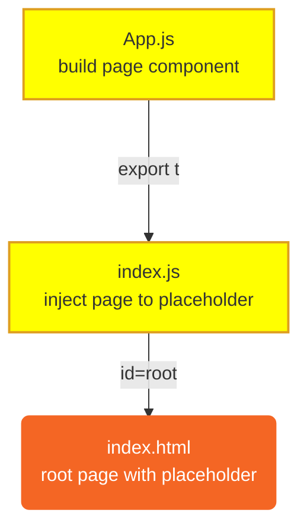
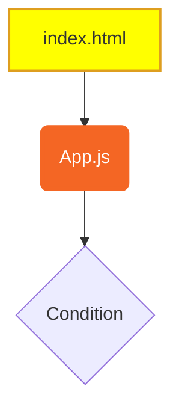
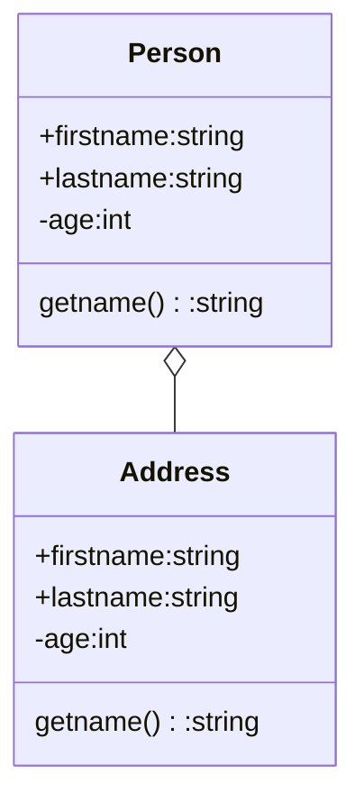
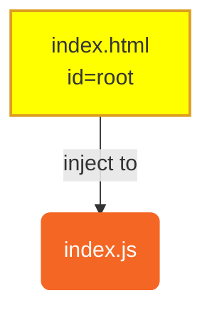
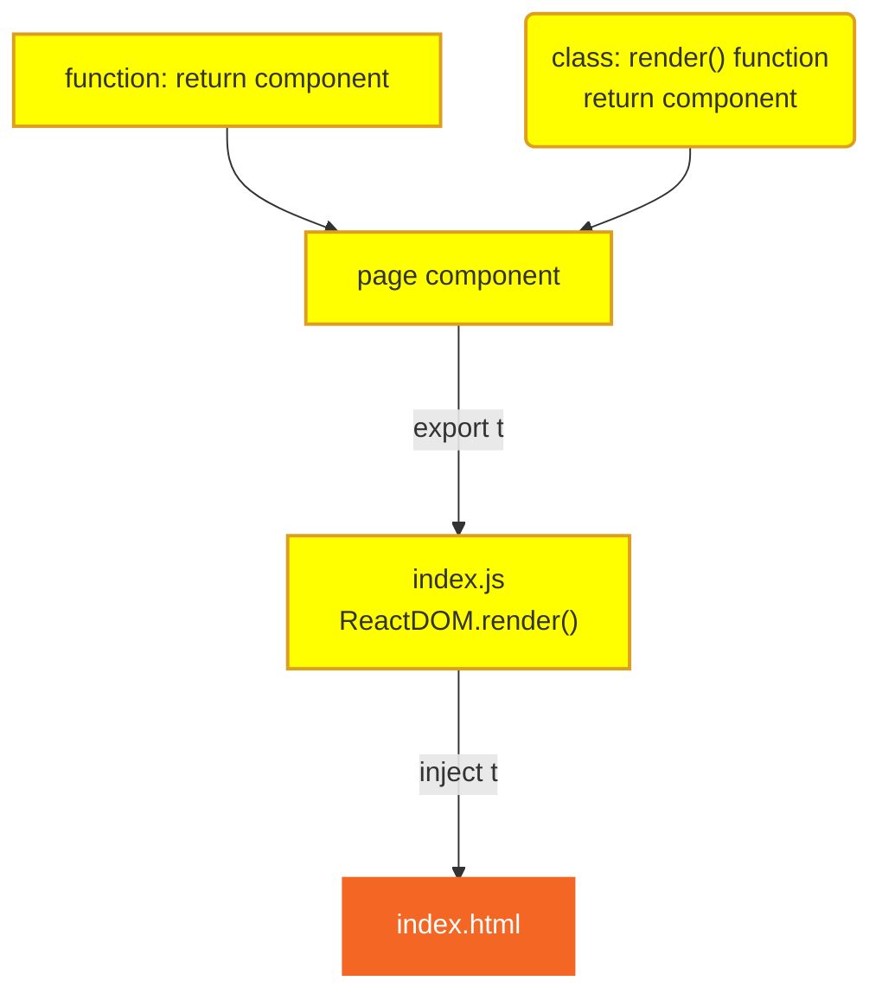
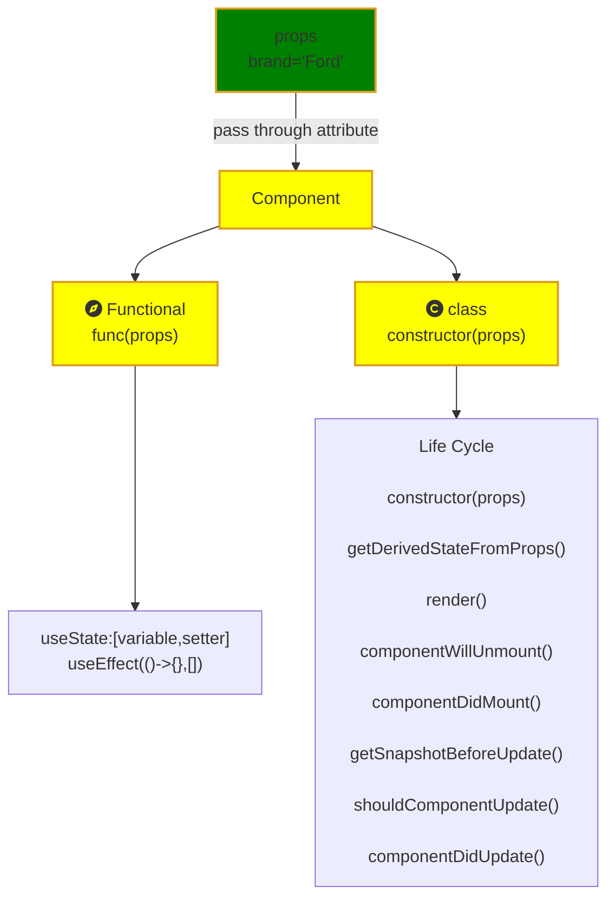

# Learning ReactJS from Screatch
[Shared copy/paste](doc/myIcons.md)
- [Learning ReactJS from Screatch](#learning-reactjs-from-screatch)
  - [Install react global tools](#install-react-global-tools)
  - [Create a new project](#create-a-new-project)
  - [Start the react application](#start-the-react-application)
  - [File Structure](#file-structure)
  - [Create a new file as AppHello.js](#create-a-new-file-as-apphellojs)
  - [Learning to use mermaid dialgram](#learning-to-use-mermaid-dialgram)
  - [Using two files](#using-two-files)
- [index.html](#indexhtml)
- [index.js](#indexjs)
  - [Create new compoment with constant](#create-new-compoment-with-constant)
  - [Create new component with function](#create-new-component-with-function)
  - [Create new component with class](#create-new-component-with-class)
  - [Class vs Function](#class-vs-function)
  - [Understand React Design](#understand-react-design)
  
## Install react global tools 
npm: Node Package Manager
```DOS
npm  install -g create-react-app
```
## Create a new project
npx: Node Package Execute
```DOS
  
npx create-react-app myreact
```

## Start the react application
```DOS
cd myreact
npm start
```
[Open browser](http://localhost:8000)

[React first page](images/firstWebPage/png)

## File Structure
```output
<app root>
    ├── public/
    |       └── index.html (root page: define placeholder <div id="root">)
    ├── src/
    |    ├── App.css (Cascading Style Sheets used in the pages)
    |    ├── App.js (page component: define function App return page block)
    |    └── index.js (controller which page goes to <div id='root'>)
    |
    ├── package.json (app configuration)
```


## Create a new file as AppHello.js
``` DOS
Only change index.html and index.js

import js file, only import './App'
import css file, import './App.css'

```
## Learning to use mermaid dialgram

right click --> command palette --> Config user snippets --> markdown.json 





## Using two files 
# index.html
# index.js


## Create new compoment with constant


## Create new component with function
* modify [index.js](myreact/src/index.js)
```js
import ReactDOM from 'react-dom';

function myFunc(){
    return <h1>Hello Jun!</h1>
}
ReactDOM.render(myFunc(), document.getElementById('root'));
```

## Create new component with class
* ⚠️ modify [index.js](myreact/src/index.js)
```js
class Car extends React.Component {
    constructor() {
        super();
        this.state = {color:"red"}
    }

    render() {
      return <h2>Hi, I am a {this.props.brand} Car with {this.state.color} color!</h2>;
    }
  }
ReactDOM.render(<Car brand="Ford"/>, document.getElementById('root'));
```

## Class vs Function

## Understand React Design

